# 🧠 Arch i3 – d1se0 Environment

> **Arch Linux i3 desktop environment**
>
> Un entorno **i3 altamente personalizado**, minimalista y profesional, diseñado para **pentesting, desarrollo y uso diario**, **probado en máquinas virtuales (VMware)** y pensado para ser **100% reproducible** mediante scripts automatizados.

GitHub Repositorio Entorno: [Download Entorno ArchLinux](https://github.com/D1se0/Arch_i3_d1se0_Environment)

---

## 👤 Autor

- **Autor:** Diseo
- **GitHub:** _[Link GitHub](https://github.com/D1se0)_
- **YouTube:** _[Link YouTube](https://www.youtube.com/@Hacking_Community)_

---

## 🧩 Descripción general

Este repositorio contiene **todo el entorno de escritorio i3** que utilizo actualmente, incluyendo:

- Dotfiles completos
- Scripts personalizados
- Automatización de instalación
- Theming dinámico con **pywal**
- LightDM sincronizado con el wallpaper
- Rofi, Polybar, i3lock, Thunar, Neovim, Zsh
- Configuración lista para **máquinas virtuales**

El objetivo es poder clonar este repositorio en una instalación limpia de Arch Linux y tener **el mismo entorno exacto** tras ejecutar un único script.

---

## 🖥️ Entorno objetivo

- **Distribución:** Arch Linux
- **WM:** i3
- **Login manager:** LightDM + GTK Greeter
- **Terminal:** Kitty
- **Shell:** Zsh
- **Barra:** Polybar
- **Launcher:** Rofi (tema personalizado)
- **Compositor:** Picom
- **File Manager:** Thunar
- **Editor:** Neovim (Lazy / Lua)
- **Theming:** pywal (dinámico)
- **VM:** Probado en **VMware**

---

## 📸 Capturas de pantalla (ENTORNO 1)

<figure>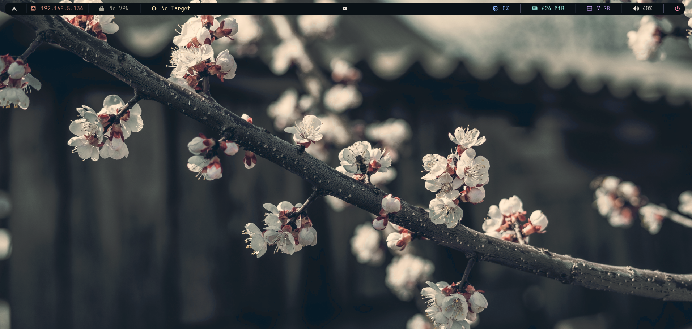<figcaption></figcaption></figure>
<figure>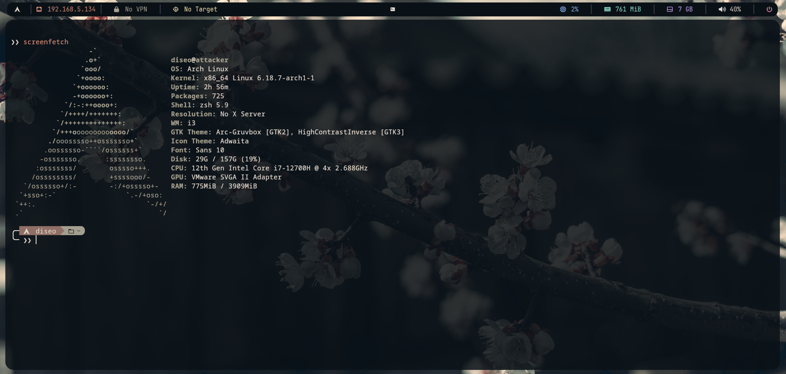<figcaption></figcaption></figure>
<figure>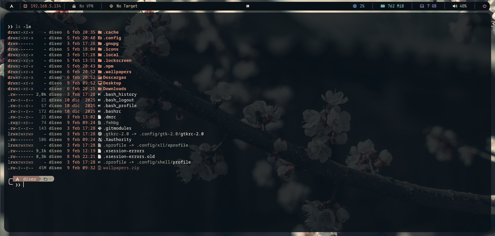<figcaption></figcaption></figure>
<figure>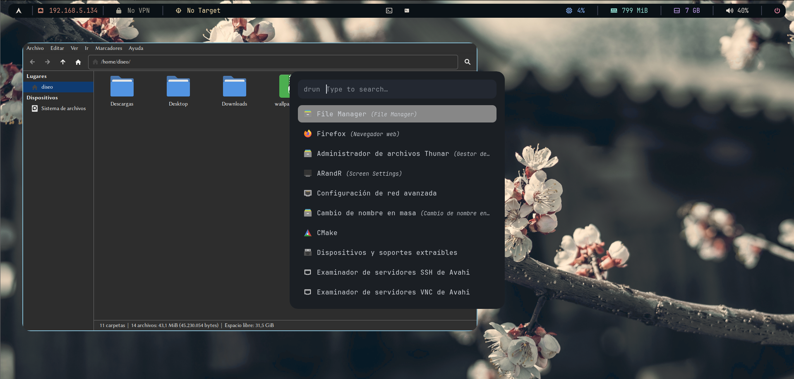<figcaption></figcaption></figure>
<figure>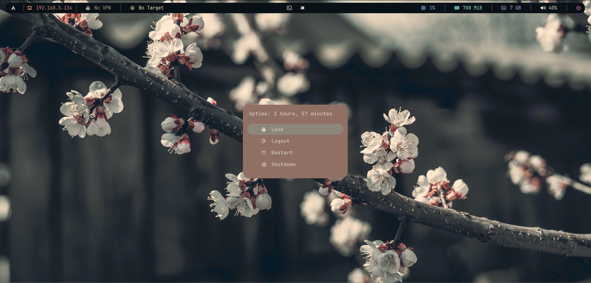<figcaption></figcaption></figure>
<figure>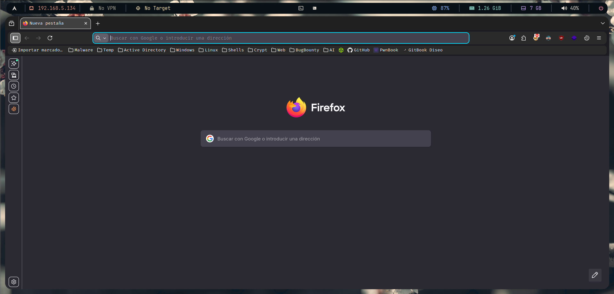<figcaption></figcaption></figure>
<figure><figcaption></figcaption></figure>
<figure><figcaption></figcaption></figure>

## 📸 Capturas de pantalla (ENTORNO 2)

<figure>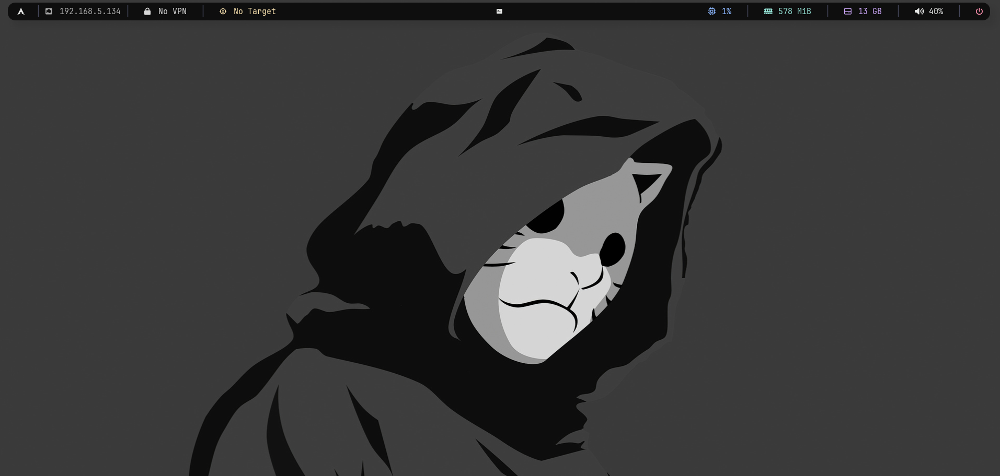<figcaption></figcaption></figure>
<figure>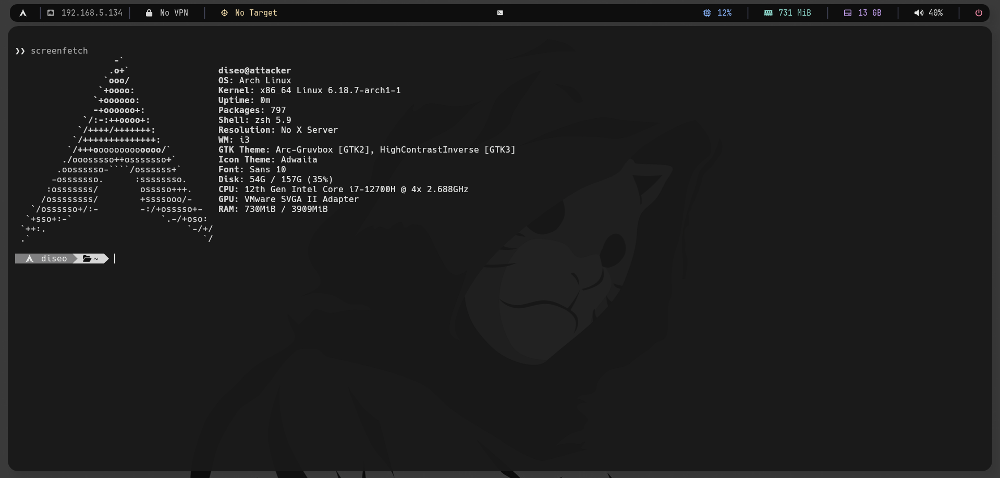<figcaption></figcaption></figure>
<figure>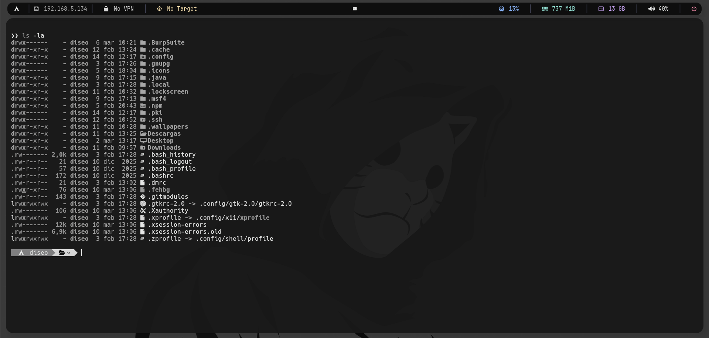<figcaption></figcaption></figure>
<figure>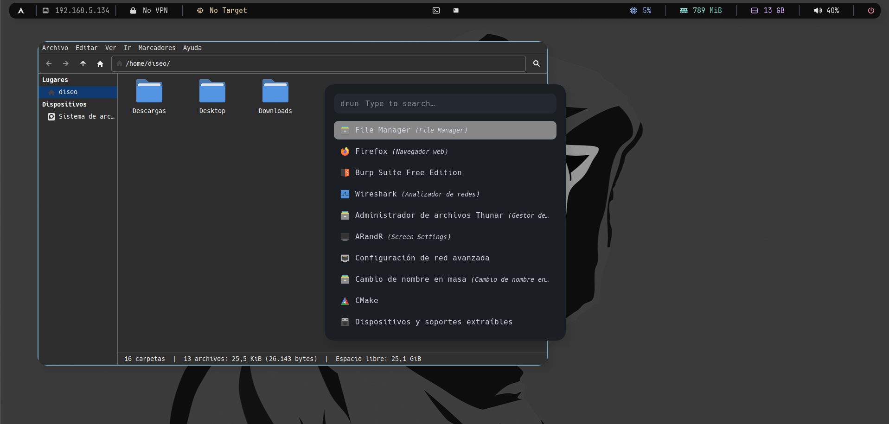<figcaption></figcaption></figure>
<figure>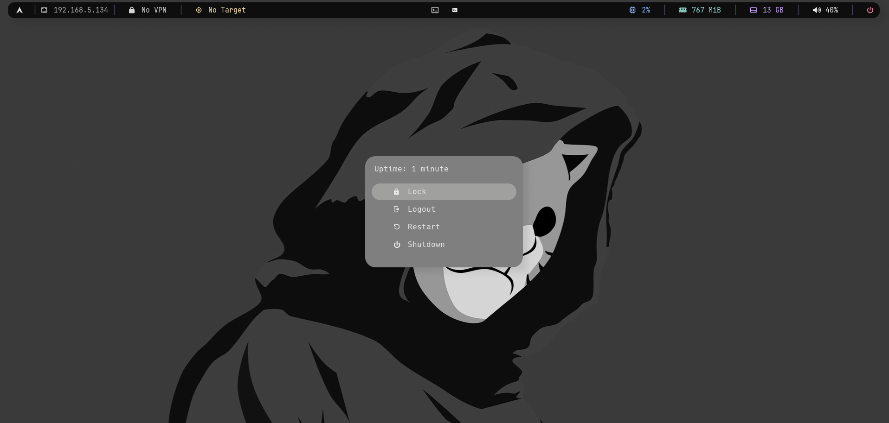<figcaption></figcaption></figure>
<figure>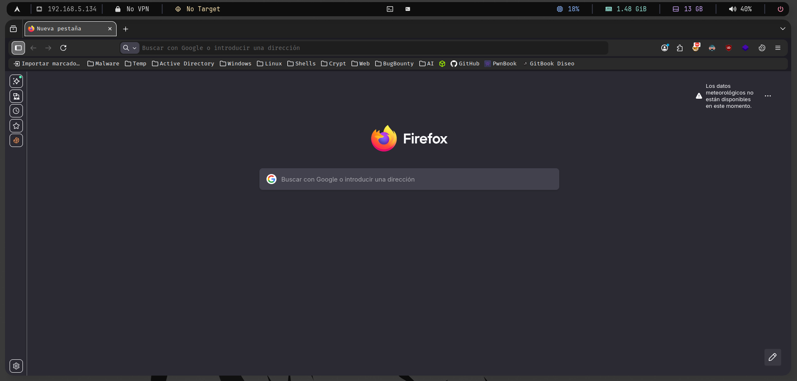<figcaption></figcaption></figure>
<figure><figcaption></figcaption></figure>
<figure>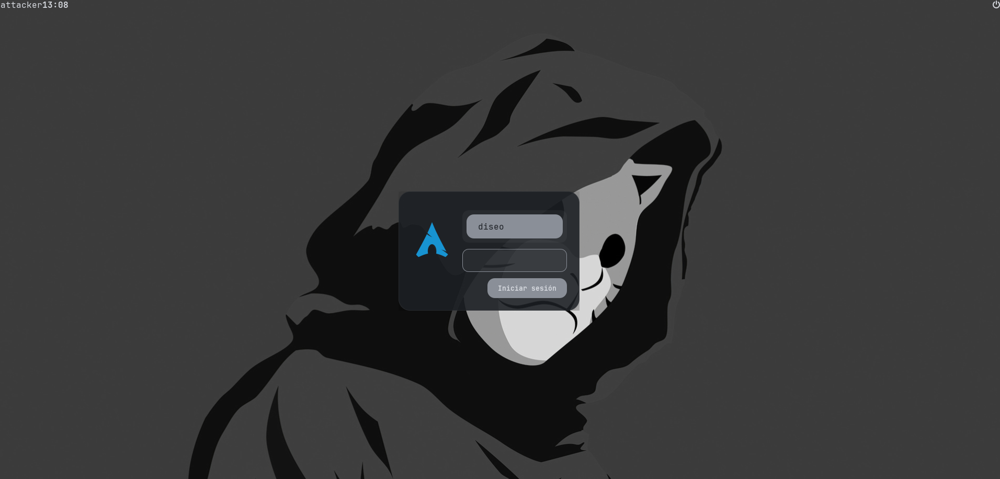<figcaption></figcaption></figure>

---

## Instalación previa para ejecutar el script

Descargar ArchLinux: [Download ArchLinux](https://archlinux.org/download/)

Una vez que se monte en una maquina virtual, tendremos que ejecutar el instalador de `archinstall` y lo configuraremos siguiendo como guía estas capturas.

<figure>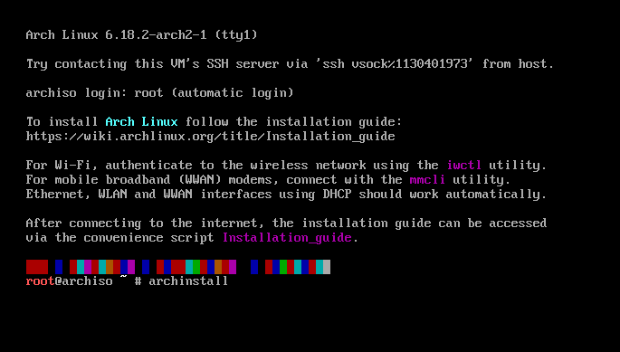<figcaption></figcaption></figure>
<figure>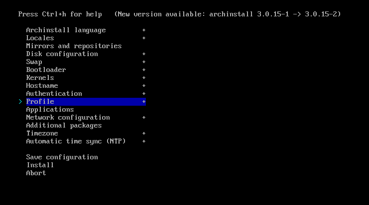<figcaption></figcaption></figure>
<figure>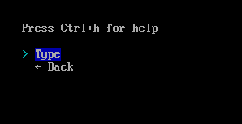<figcaption></figcaption></figure>
<figure>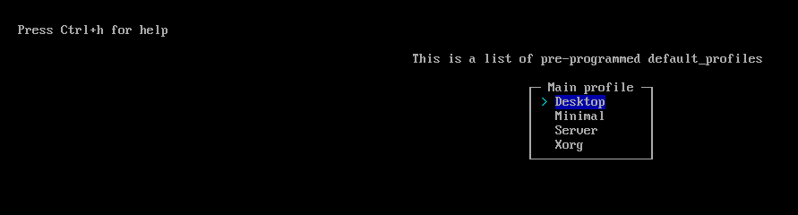<figcaption></figcaption></figure>
<figure>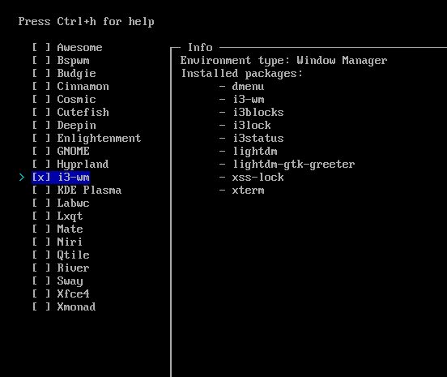<figcaption></figcaption></figure>

Después de realizar dicha instalación se recomienda instalar el `vmtools` para que se adapte todo mejor en `VMWare`:

```bash
# Instalar vmware-tools para mejor experiencia antes de instalar entorno

# Paquetes esenciales para VMware
sudo pacman -S open-vm-tools

# Para sistema con systemd
sudo systemctl enable vmtoolsd.service
sudo systemctl start vmtoolsd.service

# Si usas X11 (no Wayland)
sudo systemctl enable vmware-vmblock-fuse.service
sudo systemctl start vmware-vmblock-fuse.service

# Instala estas herramientas adicionales
sudo pacman -S gtkmm3

# Habilita el servicio de copy-paste
sudo systemctl enable vmware-user.service
sudo systemctl start vmware-user.service

# Después apagar la maquina y volver a encenderal (NO REINICIAR)
```

---

## 🧱 Estructura del repositorio

```
.
├── config/
│   ├── bin/          # Scripts personalizados → /usr/local/bin
│   ├── home/         # Dotfiles del usuario
│   └── root/         # Configuración de root
├── deps/
│   ├── pacman.txt    # Paquetes oficiales
│   └── aur.txt       # Paquetes AUR
├── scripts/
│   ├── install_deps.sh
│   ├── apply_files.sh
│   └── checks.sh
├── services/
│   └── wal-to-lightdm.service
├── sudoers/
│   └── wal-to-lightdm-theme
├── system/
│   ├── backgrounds/
│   └── lightdm/
│       ├── lightdm-gtk-greeter.conf
│       └── LightDM-Wal/
├── install.sh
└── README.md
```

---

## 🚀 Instalación completa

### 1️⃣ Instalar Arch Linux con i3

Durante la instalación con archinstall:

- Selecciona i3 como entorno gráfico
- Activa NetworkManager
- Añade tu usuario al grupo wheel

### 2️⃣ Clonar el repositorio

```bash
git clone https://github.com/D1se0/Arch_i3_d1se0_Environment.git
cd Arch_i3_d1se0_Environment/
chmod +x scripts/*
chmod +x install.sh
```

### 3️⃣ Ejecutar instalación

```bash
./install.sh
```

El script:

- Instala todas las dependencias
- Configura Zsh como shell por defecto
- Aplica dotfiles
- Copia binarios a /usr/local/bin
- Configura LightDM
- Activa servicios systemd
- Configura sudoers
- Crea enlaces simbólicos correctos
- Prepara /etc/skel para nuevos usuarios

> ⚠️ El script se ejecuta como usuario normal, pero pedirá sudo cuando sea necesario.

---

## Si `nvim` no funciona

Si `nvim` no se abre de forma correcta o se queda la pantalla sin cargar nada, es recomendable eliminar la carpeta de `nvim` de la siguiente ruta:

```bash
sudo rm -r ~/.config/nvim
```

Una vez hecho esto, en el repositorio habrá una carpeta llamada `backup_nvim` limpia la cual tendréis que mover a la ruta donde eliminasteis el `nvim` antiguo.

```bash
cp -r Arch_i3_d1se0_Environment/backup_nvim/ ~/.config/nvim
```

Instalamos dependencias para el uso de plugins extras:

```bash
sudo npm install -g pyright
```

Ahora cuando ejecutéis `nvim` se os abrirá el plugin de `lua` el cual se estará instalando todo lo necesario, una vez que se instale todo se pulsara `Shift+U` para que se actualice todo, después `Shift+S` para que se sincronice todo, y con esto ya estaría todo instalado en la parte de `Neovim`.

---

## 🎨 Theming dinámico (pywal + LightDM)

El wallpaper se define en:

```
~/.config/x11/xprofile
```

Ejemplo:

```bash
wal -i "$HOME/.wallpapers/flowers.png"
```

Un servicio systemd sincroniza automáticamente:

- LightDM
- GTK
- Rofi
- Dunst
- Zathura

Cada vez que cambias el fondo → todo el sistema se recolorea automáticamente.

---

## 🔒 Lockscreen

- Basado en i3lock
- Imagen reescalada automáticamente
- Ejecutado tanto manualmente como por inactividad

> Se puede modificar la imagen en `~/.lockscreen`

---

## ⌨️ Atajos personalizados

Ejemplos:

```
# Terminal
windows+enter → Abre una terminal de kitty
windows+w → Cierra la terminal actual de kitty o cualquier ventana de trabajo

# Dentro del entorno
F1 → Escribe tu IP (VPN → Ethernet fallback)
F2 → Escribe la IP del objetivo (~/.cache/target)
$mod + space → Rofi launcher
$mod + Enter → Terminal
$mod + w → Cierra Terminal o cualquier aplicación
$mod + {1,2,3,4...} → Cambio de ventanas

# Dentro de nvim
SPACE + t → Abre el plugin de NvimTree (Pulsando el mismo se cierra)

# Dentro de kitty
ctrl+shift+t → Juega con las ventanas de kitty extras (Abrir ventana nueva dentro de la misma terminal)
ctrl+shift+alt+t → Renombrar la ventana actual de kitty
ctrl+shift+w → Cerrar todas las ventanas de kitty abiertas por "ctrl+shift+t"

ctrl+shift+enter → Abre una ventana dentro de la misma terminal de kitty
ctrl+shift+r → Realizar un resize de la ventana actual de kitty junto con la otra abierta
   |
   |-> s → Para bajar la ventana de terminal de kitty un poco mas
   |-> t → Para subir la ventana de terminal de kitty un poco mas
   |-> q → Para salirse del resize de ventanas
ctrl+shift+w → Cierra la ventana actual de kitty abierta por "ctrl+shift+enter"
```

> Se pueden añadir mas `shortcuts` en el archivo `~/.config/i3/config`.

---

## 🧰 Binarios personalizados

Instalados en /usr/local/bin, por ejemplo:

- type-ip -> Script que se ejecuta de forma automática con F1 y F2
- settarget -> Establecer IP victima
- workdir -> Crear directorio de trabajo para una maquina victima
- extractPorts -> Extraer puertos de un escaneo de puertos de una IP
- setwall -> Para establecer fondos de pantalla de forma automática juntos con sus colores
- s -> Conexión por SSH porporcionando contraseña de forma automática
- c -> Utilizar "cat" de forma normal (Sin "bat")
- scannMachine -> Escaneo de red de una IP de forma automática
- pwnc -> Reverse shell sanitizada de forma automática (Con Payload codificado incluido)
  etc...

---

## 🌐 Firefox (configuración recomendada)

Instalación

```bash
sudo pacman -S firefox
```

> Ya se instala automáticamente

Extensiones recomendadas

Instala manualmente:

- FoxyProxy -> Configurar BurpSuite (127.0.0.1:8080)
- Dark Reader
- Cookie Editor
- uBlock Origin
- Wappalyzer

CSS personalizado (`userChrome.css`)

El repositorio incluye una carpeta chrome/ con:

`userChrome.css`

Pasos para activarlo:

- Abrir Firefox

Ir a:

`about:config`

Activar:

`toolkit.legacyUserProfileCustomizations.stylesheets = true`

-> Copiar chrome/ dentro del perfil de Firefox

Fuente recomendada

`FiraCode`

Activar en:

- Settings → Fonts
- Monospace → FiraCode

---

## 🧪 Máquina virtual (VMware)

Este entorno ha sido:

✔ Probado en VMware

✔ Optimizado para resolución dinámica

✔ Estable en sesiones prolongadas

✔ Ideal para testing / labs / desarrollo

---

## 📦 Dependencias

Las dependencias están definidas en:

- `deps/pacman.txt`
- `deps/aur.txt`

Incluyen:

- i3 / Xorg
- Polybar / Rofi / Dunst
- Zsh / Kitty
- Neovim
- Thunar
- LightDM
- Fonts / Icons / Cursors
- pywal
- Picom
- Herramientas de desarrollo

---

## 🧠 Filosofía

- Minimalista
- Productivo
- Reproducible
- Automatizado
- Profesional

---

## 📜 Licencia

Este proyecto se distribuye bajo licencia MIT.
Úsalo, modifícalo y mejóralo libremente.

---

## ⭐ ¿Te gusta?

Si este entorno te resulta útil:

- ⭐ Dale una estrella al repo
- 📺 Sígueme en YouTube
- 🧠 Fork \& customize

Made with ❤️ by d1se0
