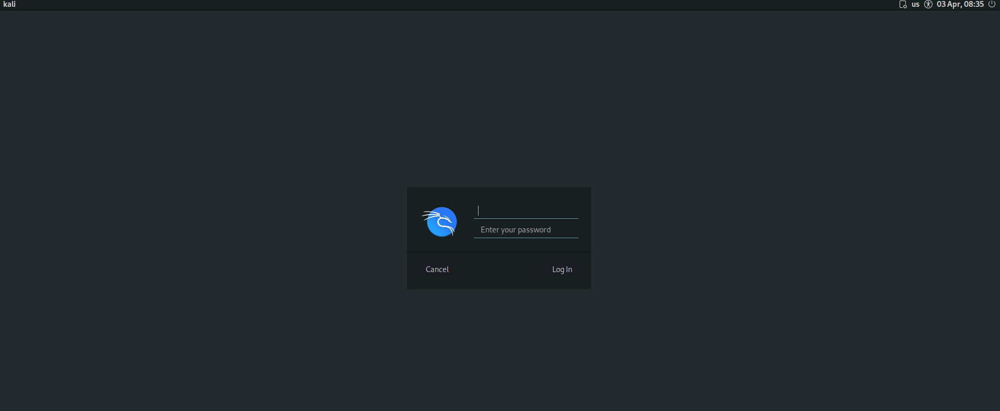
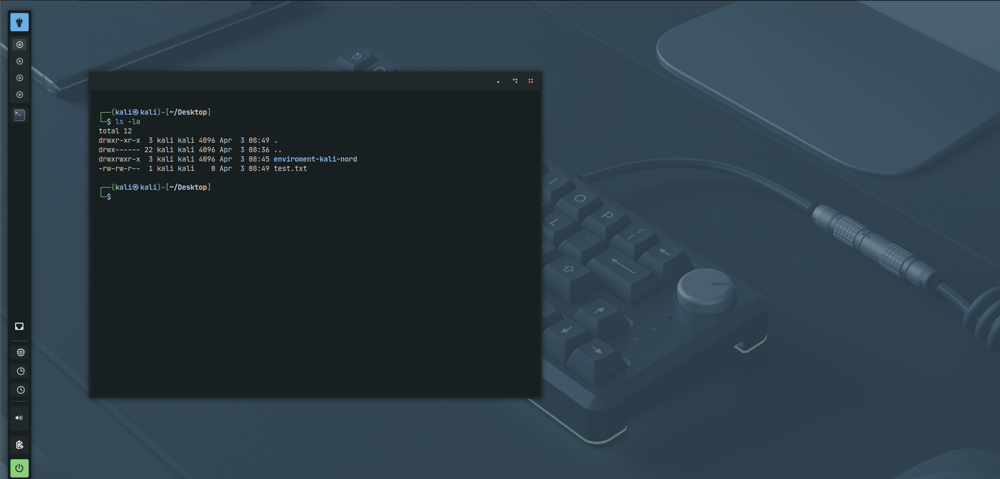
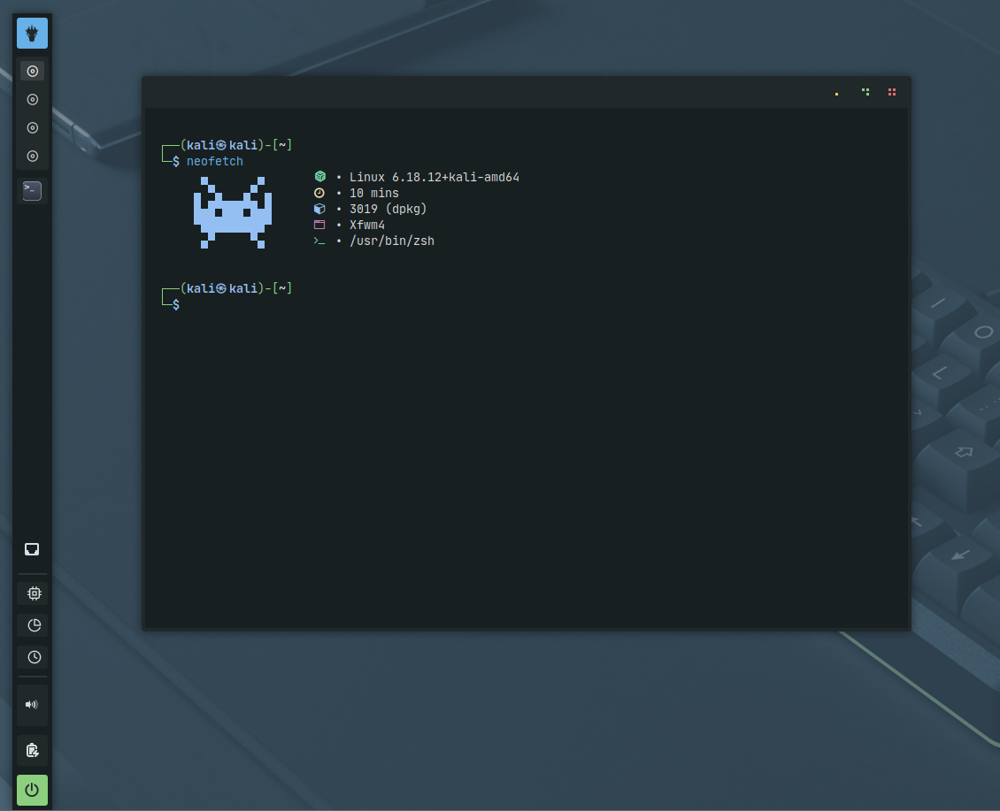
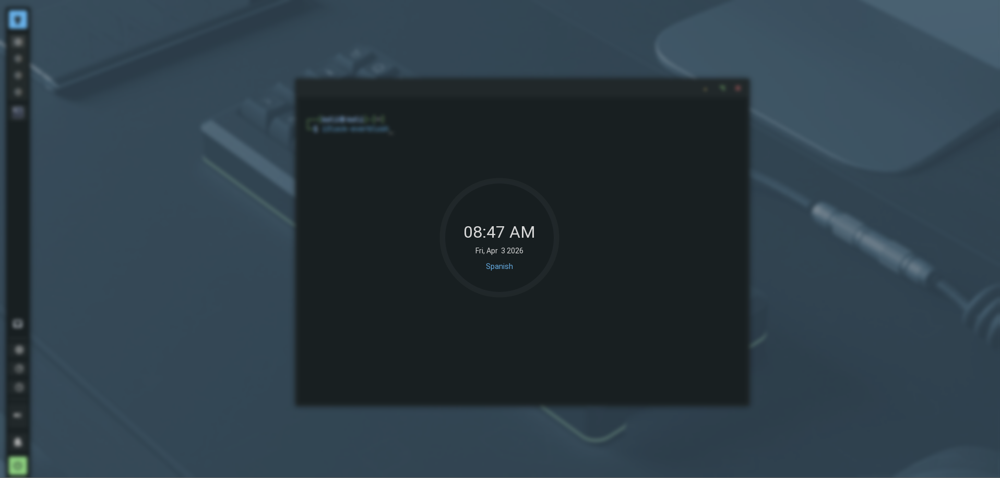
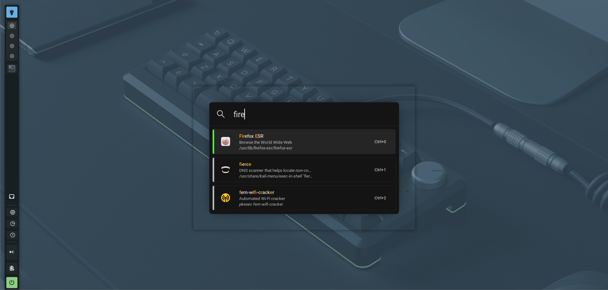
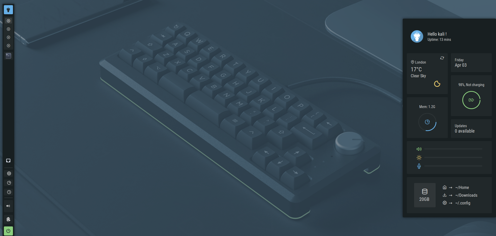
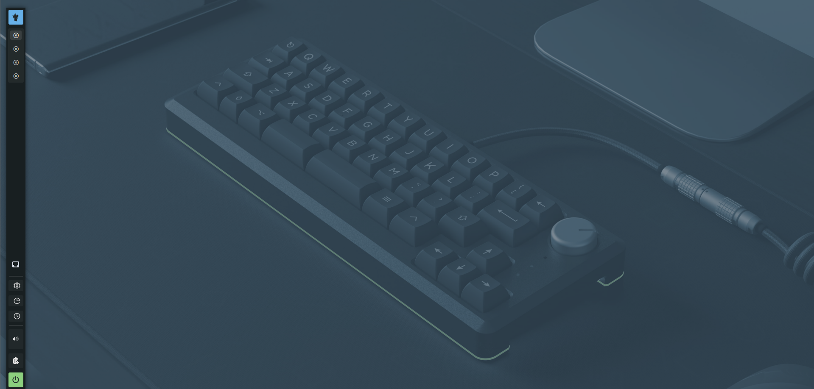
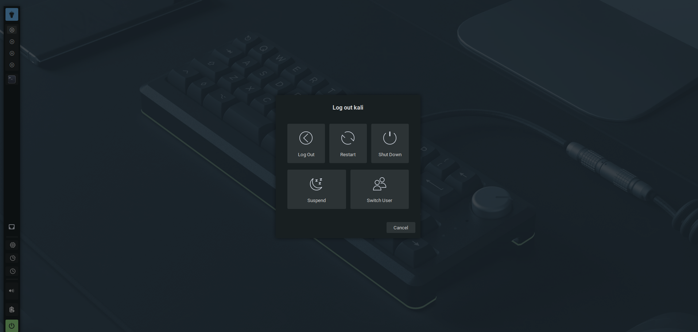

# ❄️ Kali Nordic Environment

Minimalist, clean and modern XFCE environment for Kali Linux, designed for hacking workflows without sacrificing a polished graphical experience.

> ⚠️ Built specifically for Kali Linux 6.18.12+kali-amd64 (2026)

Source: [Source Credits](https://www.pling.com/p/1908883/)

Link: [Download Environment GitHub by D1se0](https://github.com/D1se0/environment-kali-nordic)

---

## 🧠 Overview

This project transforms a default Kali XFCE installation into a **Nordic-inspired, productivity-focused desktop**.

✔ Clean UI  
✔ Optimized for pentesting workflows  
✔ Lightweight & fast  
✔ Hybrid usage (GUI + terminal)

---

## 📦 Features

- 🎨 Everblush GTK + XFWM theme
- 🧊 Nordzy icon pack (cyan dark MOD)
- 🖱️ Radioactive Nord cursors
- 🔤 Custom fonts (JetBrainsMono Nerd Font + Roboto)
- 🪟 Kvantum theming (Qt apps consistency)
- 🌫️ Picom compositor (smooth visuals)
- 📊 Custom XFCE panel (system monitors, dock-like)
- ⚡ EWW widgets (modern UI panels)
- 🔎 Findex launcher (Spotlight-like search)
- 🔒 Custom i3lock lockscreen
- 🖥️ Neofetch fully customized
- 🖼️ Nordic wallpapers pack

---

## 🖼️ Images Environment

<figure><figcaption></figcaption></figure>
<figure><figcaption></figcaption></figure>
<figure><figcaption></figcaption></figure>
<figure><figcaption></figcaption></figure>
<figure><figcaption></figcaption></figure>
<figure><figcaption></figcaption></figure>
<figure><figcaption></figcaption></figure>
<figure><figcaption></figcaption></figure>

---

## ⚙️ Requirements

- Kali Linux (recommended version):

```
6.18.12+kali-amd64
```

- User:

```
kali
```

- Must have:

```
sudo privileges (NOPASSWD recommended)
```

---

## 🚀 Installation

```bash
chmod +x install.sh
./install.sh
```

The script will:

- Validate system version
- Install dependencies
- Apply themes, icons and fonts
- Configure XFCE
- Install all tools automatically

---

## ⚠️ Manual Steps (IMPORTANT)

🖼️ Set Wallpaper

Go to:

```
Desktop → Background
```

Then:

```
Folder → Other...
```

Select:

```
/home/kali/.local/share/wallpapers
```

Recommended wallpaper:

```
mechanic-keyboard.png
```

---

## 🎨 LightDM Color Fix

Open:

```
LightDM GTK Greeter Settings
```

Set custom color:

```
#232a2d
```

Save and exit.

---

## 📊 XFCE Panel (Generic Monitor)

`Right click panel` → `Panel Preferences` → `Items`

Configure:

**CPU**

```
/home/kali/genmon-scripts/cpu.sh
Label (Desactivarlo)
Period: 2.00
```

**RAM**

```
/home/kali/genmon-scripts/mem.sh
Label (Desactivarlo)
Period: 2.00
```

**TIME**

```
/home/kali/genmon-scripts/datetime.sh
Label (Desactivarlo)
Period: 0.25
```

Disable labels in all.

---

## ⚡ EWW

Default shortcut:

```
Shift + S
```

To change:

`Settings` → `Keyboard` → `Application Shortcuts`

---

## 🔎 Findex

Default shortcut:

```
Shift + Space
```

---

## 🔐 Notes

- Designed for XFCE (not GNOME/KDE)
- Not guaranteed to work on other Kali versions
- Some UI elements require manual adjustment

---

## 🧪 Troubleshooting

If something fails:

```bash
cat install.log
```

---

## 🧑‍💻 Author

- GitHub: https://github.com/D1se0
- YouTube: Diseo (@hacking_community)
- TikTok: Diseo (@hacking_community)

---

## ⚠️ Disclaimer

This environment is intended for **educational and ethical hacking purposes only**.

Use responsibly.

---

## ⭐ Support

If you like the project:

⭐ Star the repo

🍴 Fork it

📢 Share it
