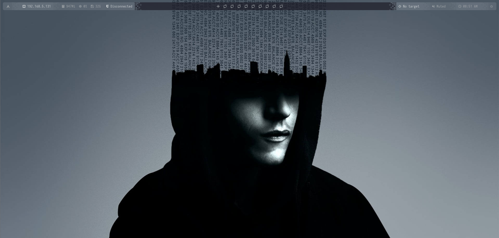
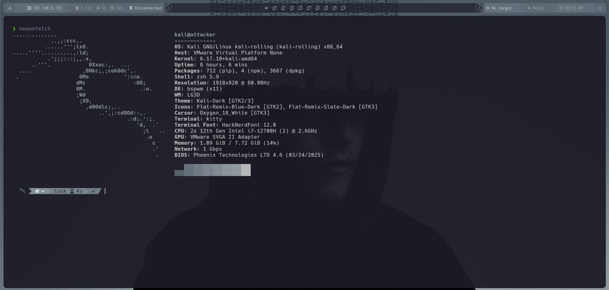
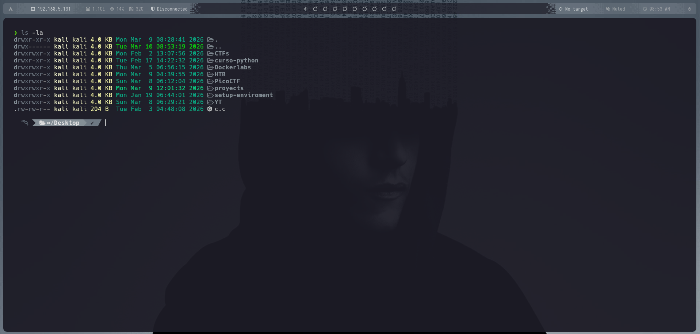
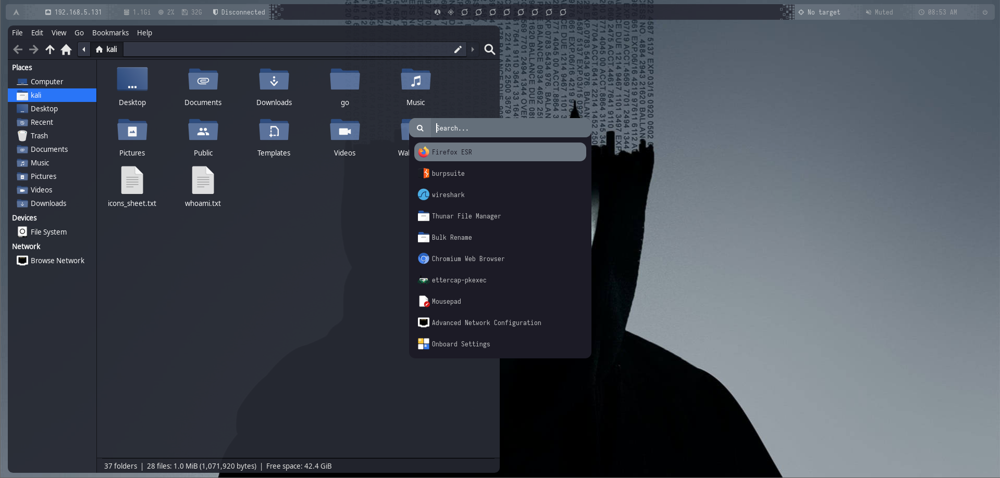
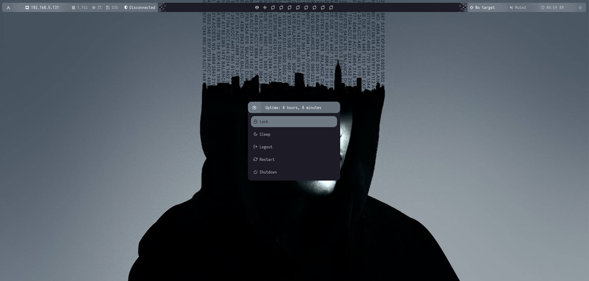
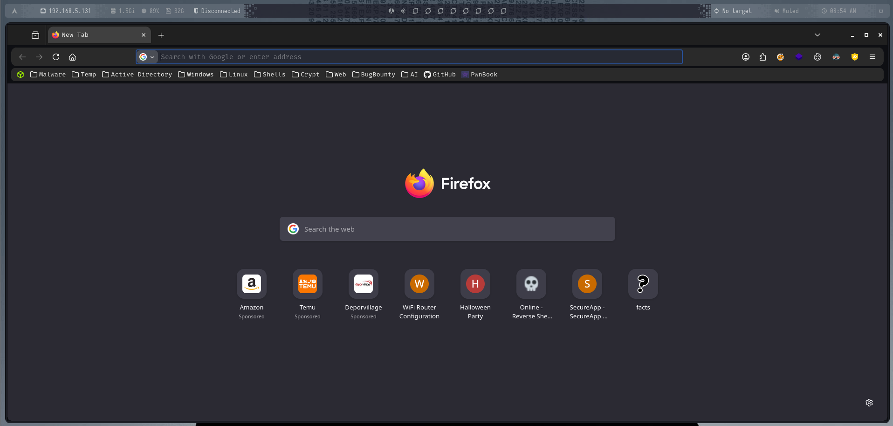
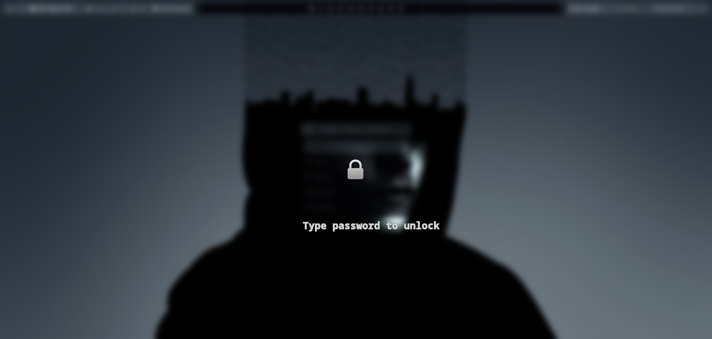
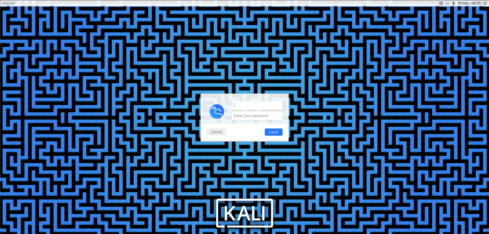

# 🧠 Kali Linux bspwm – @d1se0 Environment (Fork de @Gamuke)

> **Kali Linux bspwm desktop environment**
>
> Un entorno **bspwm altamente personalizado**, minimalista y profesional, diseñado para pentesting, desarrollo y uso diario, probado en máquinas virtuales (VMware) y pensado para ser **100% reproducible** mediante scripts automatizados.

Entorno Kali by Diseo: [Download Entorno Kali Linux](#kali-link)

GitHub Repositorio Original: [Download Entorno Kali Linux (Original)](https://github.com/GalileoQ/Kali_Linux-Auto-Bspwm)

---

## 👤 Autor

- **Autor**: Diseo
- **GitHub**: _[Link GitHub](https://github.com/D1se0)_
- **YouTube**: _[Link YouTube](https://www.youtube.com/@Hacking_Community)_

---

## 🧩 Descripción general

Este repositorio contiene **todo el entorno de escritorio bspwm** que utilizo actualmente, incluyendo:

- Dotfiles completos
- Scripts personalizados
- Automatización de instalación
- Theming dinámico con **pywal**
- LightDM sincronizado con el wallpaper
- Rofi, Polybar, sxhkd, Thunar, Neovim, Zsh
- Configuración lista para máquinas virtuales

El objetivo es poder clonar este repositorio en una instalación limpia de Kali Linux y tener el mismo entorno exacto tras ejecutar un único script.

---

## 🖥️ Entorno objetivo

- **Distribución:** Kali Linux (Rolling Release)
- **WM:** bspwm
- **Hotkey daemon:** sxhkd
- **Login manager:** LightDM + GTK Greeter
- **Terminal:** Kitty
- **Shell:** Zsh
- **Barra:** Polybar
- **Launcher:** Rofi (tema personalizado)
- **Compositor:** Picom
- **File Manager:** Thunar
- **Editor:** Neovim (Lazy / Lua)
- **Theming:** pywal (dinámico)
- **VM:** Probado en VMware

---

## 📸 Capturas de pantalla

<figure><figcaption></figcaption></figure>
<figure><figcaption></figcaption></figure>
<figure><figcaption></figcaption></figure>
<figure><figcaption></figcaption></figure>
<figure><figcaption></figcaption></figure>
<figure><figcaption></figcaption></figure>
<figure><figcaption></figcaption></figure>
<figure><figcaption></figcaption></figure>

---

## Instalación previa para ejecutar el script

Descargar Kali Linux: [Download Kali Linux](https://www.kali.org/get-kali/#kali-virtual-machines)

Montar en máquina virtual, luego asegurarse de instalar paquetes esenciales y sudo:

```bash
sudo apt update && sudo apt upgrade -y
sudo apt install git curl wget sudo -y
```

Después se recomienda instalar open-vm-tools para mejor integración en VMware:

```bash
sudo apt install open-vm-tools open-vm-tools-desktop -y
sudo systemctl enable vmtoolsd
sudo systemctl start vmtoolsd
```

---

## 🚀 Instalación completa

### 1️⃣ Preparar Kali Linux con bspwm

- Seleccionar instalación mínima
- Instalar sudo y tu usuario al grupo sudo
- Instalar bspwm y sxhkd si no viene por defecto:

```bash
sudo apt install bspwm sxhkd -y
```

### 2️⃣ Descargar Entorno Drive

Simplemente entra en el link de Drive, descomprime el `.zip` dentro de un `Kali Linux` y sigue los pasos siguiente

### 3️⃣ Ejecutar instalación

```bash
./update-upgrade.sh
./setup.sh
```

El script:

- Instala todas las dependencias (apt / extras)
- Configura Zsh como shell por defecto
- Aplica dotfiles
- Copia binarios a /usr/local/bin
- Configura LightDM
- Activa servicios systemd
- Configura sudoers
- Crea enlaces simbólicos correctos
- Prepara /etc/skel para nuevos usuarios

> ⚠️ El script se ejecuta como usuario normal, pero pedirá sudo cuando sea necesario.

---

## ⌨️ Atajos personalizados

Ejemplos para bspwm/sxhkd:

```
# Terminal
super + Enter → Abre kitty
super + w → Cierra ventana actual

# Navegación de ventanas
super + {h,j,k,l} → Mover enfoque entre ventanas
super + shift + {h,j,k,l} → Mover ventana

# Rofi launcher
super + space → Abrir launcher

# Neovim
SPACE + t → Abre NvimTree

# Kitty
ctrl+shift+t → Nueva ventana
ctrl+shift+w → Cierra ventana actual
```

> Atajos adicionales en `~/.config/sxhkd/sxhkdrc`.

---

## 🧰 Binarios personalizados

Instalados en /usr/local/bin:

- settarget -> Establecer IP victima
- workdir -> Crear directorio de trabajo para una maquina victima
- extractPorts -> Extraer puertos de un escaneo de puertos de una IP
- s -> Conexión por SSH porporcionando contraseña de forma automática
- c -> Utilizar "cat" de forma normal (Sin "bat")
- scannMachine -> Escaneo de red de una IP de forma automática
- pwnc -> Reverse shell sanitizada de forma automática (Con Payload codificado incluido)
  etc...

---

## 🌐 Firefox (configuración recomendada)

```bash
sudo apt install firefox-esr -y
```

Extensiones recomendadas: `FoxyProxy`, `Dark Reader`, `Cookie Editor`, `uBlock Origin`, `Wappalyzer`

CSS personalizado: `userChrome.css` incluido en repo → activar `toolkit.legacyUserProfileCustomizations.stylesheets = true`

Fuente recomendada: `FiraCode`

---

## 🧪 Máquina virtual (VMware)

✔ Probado en VMware

✔ Resolución dinámica

✔ Estable en sesiones prolongadas

✔ Ideal para pentesting / labs / desarrollo

---

## 📦 Dependencias

- bspwm / sxhkd
- Xorg
- Polybar / Rofi / Dunst
- Zsh / Kitty
- Neovim
- Thunar
- LightDM
- Fonts / Icons / Cursors
- pywal
- Picom

Herramientas de pentesting y desarrollo (Kali)

---

## 🧠 Filosofía

- Minimalista
- Productivo
- Reproducible
- Automatizado
- Profesional

---

## 📜 Licencia

Licencia MIT. Úsalo, modifícalo y mejóralo libremente.

---

## ⭐ ¿Te gusta?

- ⭐ Dale una estrella al repo
- 📺 Sígueme en YouTube
- 🧠 Fork & customize

Made with ❤️ by @d1se0 (Fork de @Gamuke)
