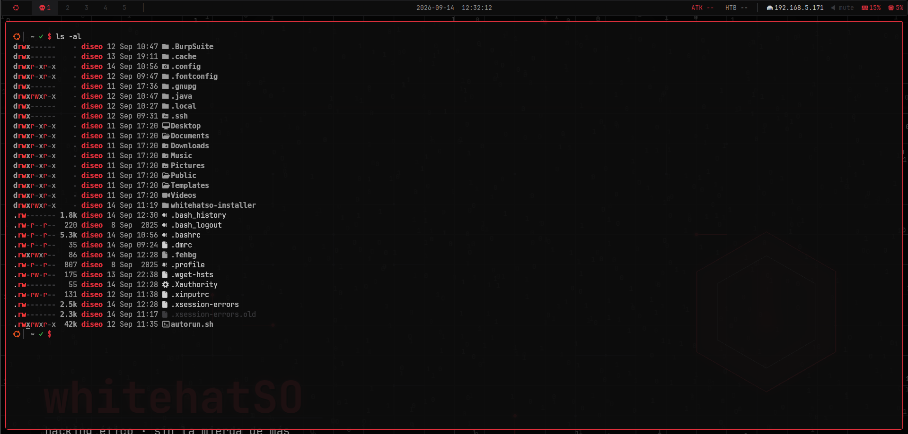
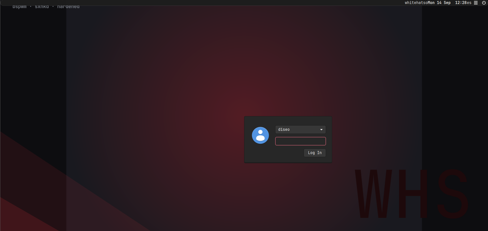
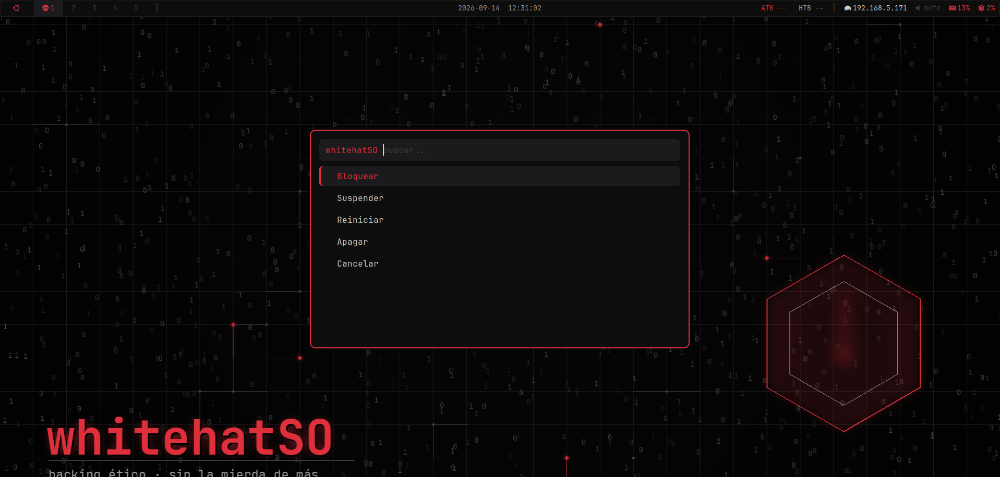
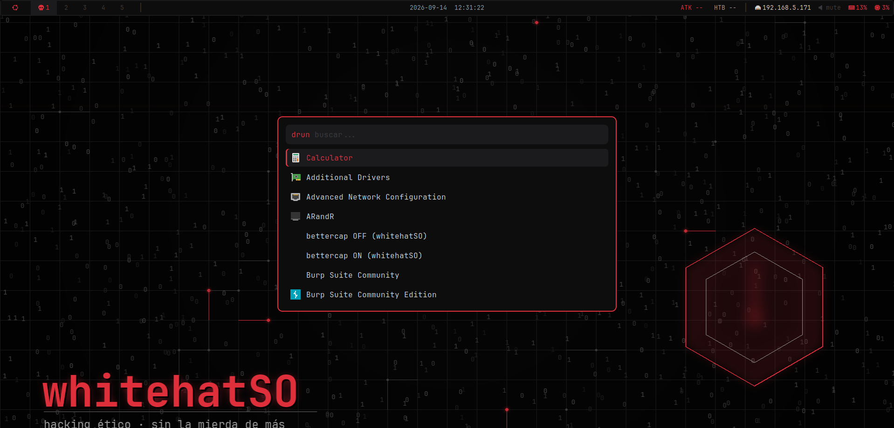
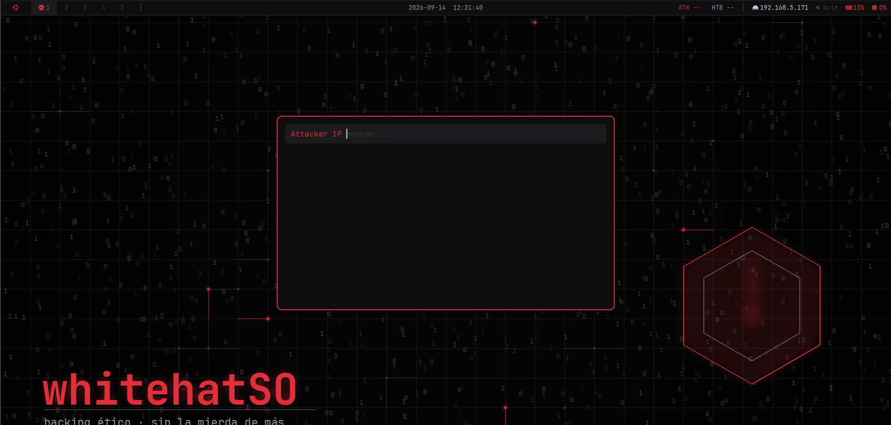
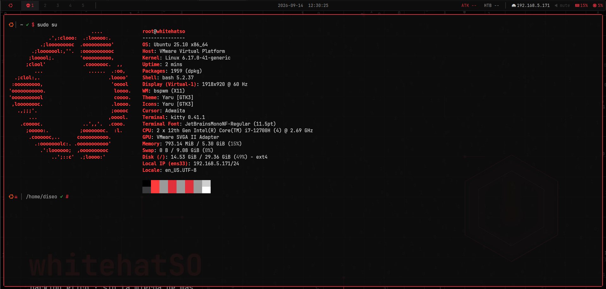
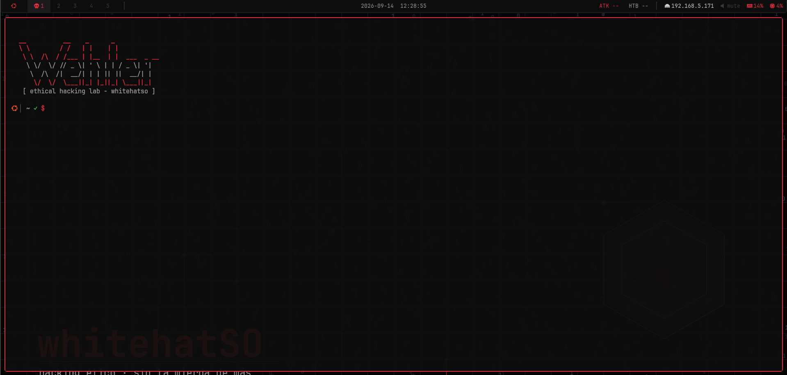

# 💀 whitehatSO Environment

Turn a fresh (or your everyday) Ubuntu 25.10 into a complete **ethical hacking lab**: binary tiling with bspwm, kitty with its own red terminal identity (#e0303c), a fully operative polybar, performance tuned to the last byte and **zero telemetry**.

> ⚠️ Built specifically for **Ubuntu 25.10** (other versions may work but are untested; the installer warns you)

Source: [whitehatSO — environment-ubuntu-installer](https://github.com/D1se0/environment-ubuntu-installer)

Link: [Download Environment GitHub by D1se0](https://github.com/D1se0/environment-ubuntu-installer)

---

## 🧠 Overview

whitehatSO is not a new distribution: it's a **set of configurations, scripts and system tweaks** that transform Ubuntu into a working environment for offensive/defensive cybersecurity, with a red terminal aesthetic and the philosophy *minimal + fast + everything under control*.

✔ Binary tiling desktop (bspwm + sxhkd)  
✔ kitty with its own red identity and safe-close dialog  
✔ polybar with attacker-IP module (ATK) and service control  
✔ Performance tuned: zram, earlyoom, debloat  
✔ Zero telemetry — auditable public whitelist  
✔ Self-contained installer (configs embedded, no runtime downloads)  

---

## 📦 Features

- 🪟 **bspwm** (binary tiling) + **sxhkd** (hotkeys) + **picom** tuned for VMs
- 🐱 **kitty**: red/grey palette, 0.92 transparency, powerline tabs, Ctrl+W close with Si/No confirmation (kitty-protocol safe — no `9;9u` garbage)
- 📊 **polybar**: **ATK module** (attacker IP via `settarget`), bettercap/tor control, power menu
- 💀 **Custom bash prompt**: Ubuntu logo + absolute path + ✓/✗ of last command + **red ☠ and `#` in root mode**
- 🚀 **rofi** launcher with floating rules and the integrated close dialog
- 🔐 **lightdm** + themed GTK greeter (Yaru-red-dark, generative red background, JetBrains Mono)
- ⚡ **Performance**: zram zstd (up to 8 GB), swappiness 10, journald 150 MB, earlyoom anti-freeze, `none` I/O scheduler on SSD/VM
- 🧹 **Debloat**: telemetry out (whoopsie, apport, ubuntu-report/insights, unattended-upgrades), snapd out (native Firefox .deb)
- 🖥️ **VMware**: real dynamic resolution (modesetting + RandR), bidirectional host↔VM clipboard, in-session autofit
- 🛠️ **Own tools**: `whs-bettercap`, `whs-status`, `whs-help`, `settarget`, `whitehatso-close`, `whitehatso-lock`
- 🖼️ Generative red login background + wallpapers pack

---

## 🖼️ Images Environment

<figure><figcaption>Login whitehatSO — greeter temático con fondo generativo rojo</figcaption></figure>
<figure><figcaption>Wallpaper incluido en el pack</figcaption></figure>








---

## ⚙️ Requirements

- Ubuntu (recommended version):

```
25.10
```

- User:

```
any user with sudo privileges (NOPASSWD recommended)
```

- Must have:

```
internet connection (apt packages + JetBrainsMono Nerd Font download)
```

---

## 🚀 Installation

### Option A — self-contained installer (recommended)

The script has all configs, scripts and wallpapers **embedded** (it downloads nothing from the repo at runtime):

```bash
curl -fsSL https://raw.githubusercontent.com/D1se0/environment-ubuntu-installer/main/install-whitehatso.sh -o install-whitehatso.sh
chmod +x install-whitehatso.sh
sudo bash install-whitehatso.sh
```

The installer will ask you what you want to apply:

1. **User** to configure
2. **Base packages** (Xorg, lightdm, bspwm, kitty, polybar, rofi, fonts…)
3. **Performance** (zram, sysctl, telemetry/services debloat, native Firefox .deb)
4. **Themed lightdm login**
5. **VMware fixes** (dynamic resolution + clipboard)
6. **Skull prompt** for root too

When it finishes: **log out** and pick the **whitehatSO (bspwm)** session in the login menu.

### Option B — unattended mode

Ideal for scripting, chroots (Cubic) or replicating across machines:

```bash
WHS_ASSUME_YES=1 WHS_USER=your_user sudo -E bash install-whitehatso.sh
```

### Option C — clone and build

```bash
git clone https://github.com/D1se0/environment-ubuntu-installer.git
cd environment-ubuntu-installer
bash build-installer.sh        # regenerates install-whitehatso.sh from payload/
sudo bash install-whitehatso.sh
```

---

## 🔒 Safety by design (IMPORTANT)

The installer includes a **protected package list** (`xorg`, `lightdm`, `bspwm`, `mesa`, …) that is **never** removed during the debloat, and it **backs up** all your previous configs to:

```
~/.config/backups/whitehatso-<date>/
```

Nothing touches your user or your data. If anything goes wrong, restore from the backup folder.

---

## ⌨️ Keybindings

All of them live in `~/.config/sxhkd/sxhkdrc`. *super* = Windows key.

| Shortcut | Action |
|---|---|
| `super + Return` | Open kitty |
| `super` / `ctrl + space` | Rofi (app launcher) |
| `ctrl + w` | **Close window with Si/No confirmation** |
| `super + shift + q` | Close window without confirmation |
| `super + {1…5}` | Go to desktop 1–5 |
| `super + shift + {1…5}` | Send window to desktop 1–5 |
| `super + h/j/k/l` | Focus (vim-style) |
| `super + shift + h/j/k/l` | Swap windows |
| `super + ctrl + h/j/k/l` | Resize windows |
| `super + f` | Fullscreen (toggle) |
| `super + shift + space` | Float (toggle) |
| `super + shift + l` | Lock screen (red i3lock with blurred capture) |
| `super + shift + r` | Reload sxhkd |
| `print` | Flameshot (screenshot with editor) |
| `super + left/right click` | Move / resize with mouse |

> In kitty, `ctrl+w` is **also mapped inside the terminal** so the kitty keyboard protocol doesn't swallow the key (avoids the famous `9;9u`). Bonus: bash itself interprets the `119;5u`/`9;9u` sequences as close, in case you use another terminal with kitty protocol (ptyxis, ghostty…).

---

## 🛠️ Own commands

| Command | What it does |
|---|---|
| `whs-bettercap on\|off` | Start/stop bettercap + tor on demand |
| `whs-status` | RAM, disk, zram and tor/bettercap/snapd status |
| `whs-help` | Command cheat sheet |
| `settarget 10.10.14.7` | Marks the target IP → polybar **ATK** module shows it in red (`settarget` with no argument clears it) |
| `whitehatso-close` | Si/No close dialog (what Ctrl+W uses) |
| `whitehatso-lock` | Lock with blurred background and red ring |

---

## 💀 The prompt

```
  │ ~/current/path ✓ $
  │ /etc ✗ #          ← (in root: red ☠ and #)
```

- Ubuntu logo (Nerd Font glyph, orange)
- ☠ appears only with `sudo -i` / `su -`
- ✓ green if the last command succeeded, ✗ red if it failed
- **Absolute** path always

---

## ⚡ Performance: what changes

| Tweak | Value |
|---|---|
| zram | `min(ram, 8192)` MB, zstd, priority 100 |
| vm.swappiness | 10 |
| vm.vfs_cache_pressure | 50 |
| vm.page-cluster | 0 |
| kernel.nmi_watchdog | 0 |
| journald | 150 MB, compressed |
| I/O scheduler | `none` (SSD/VM) via udev |
| earlyoom | active (prevents RAM freezes) |
| Telemetry | whoopsie, apport, ubuntu-report/insights, unattended-upgrades: **purged** |
| snapd | removed (native Mozilla Firefox .deb if missing) |

Reference state (VM with 4 vCPU / 5.3 GB): **~850 MiB RAM at idle**, 0 failed systemd units.

---

## 🔐 Notes

- Designed for **bspwm** (not GNOME/KDE) — the installer sets up the session entry automatically
- The VMware module is optional; on physical hardware it's harmless but unnecessary
- The kitty Ctrl+W fix also covers other terminals with kitty keyboard protocol
- Tested on VMware Workstation; VirtualBox/QEMU should work with the standard bspwm session

---

## 🧪 Troubleshooting

If something fails during install:

```bash
sudo bash install-whitehatso.sh 2>&1 | tee install.log
```

If the session doesn't appear at login, make sure the installer's step 2 (base packages) and step 4 (lightdm) were applied, then:

```bash
sudo systemctl status lightdm
ls /usr/share/xsessions/
```

Full docs, FAQ and website: [environment-ubuntu-installer](https://github.com/D1se0/environment-ubuntu-installer) · [Web](https://d1se0.github.io/environment-ubuntu-installer/)

---

## 🧑‍💻 Author

- GitHub: https://github.com/D1se0
- YouTube: Diseo (@hacking_community)
- TikTok: Diseo (@hacking_community)

---

## ⚠️ Disclaimer

This environment is intended for **educational and ethical hacking purposes only**.

Use responsibly.

---

## ⭐ Support

If you like the project:

⭐ Star the repo

🍴 Fork it

📢 Share it
